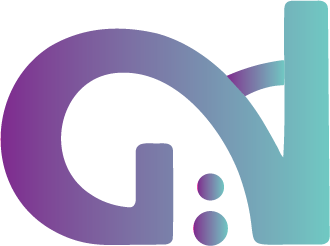

# AdoGe Innovations



**Impulsamos tu presencia digital**

Sitio web profesional para servicios de desarrollo web, UX/UI y soluciones digitales para emprendedores, profesionales y negocios. 

---

## 🚀 Características principales

- **Diseño responsive**: Perfecto en desktop y mobile.
- **Logo personalizado** y favicon propio.
- **Cards visuales** para presentación de equipo y servicios.
- **Animaciones suaves** y detalles modernos.
- **SEO y Social Sharing**: Meta tags Open Graph y Twitter Card para un link preview profesional.
- **Contacto directo**: Formulario funcional y acceso rápido a WhatsApp.

---

## 🖼️ Preview


---

## 📱 Link Preview personalizado

Al compartir el link en WhatsApp, Facebook, etc., se mostrará el logo y la descripción personalizada.

- **Imagen:** Cambia `public/logo192.png` por tu logo cuadrado (ideal 300x300px o más).
- **Meta tags:** Edita en `public/index.html`:

```html
<meta property="og:title" content="AdoGe Innovations" />
<meta property="og:description" content="Impulsamos tu presencia digital. Desarrollo web, UX/UI y soluciones digitales para emprendedores, profesionales y negocios." />
<meta property="og:image" content="https://adoge-innovations.vercel.app/logo192.png" />
<meta property="og:type" content="website" />
<meta property="og:url" content="https://adoge-innovations.vercel.app/" />
<meta name="twitter:card" content="summary_large_image" />
<meta name="twitter:title" content="AdoGe Innovations" />
<meta name="twitter:description" content="Impulsamos tu presencia digital. Desarrollo web, UX/UI y soluciones digitales para emprendedores, profesionales y negocios." />
<meta name="twitter:image" content="https://adoge-innovations.vercel.app/logo192.png" />
```

- **Forzar actualización:** Usa el [Facebook Debugger](https://developers.facebook.com/tools/debug/) tras cada deploy.

---

## 🛠️ Scripts útiles

- `npm install` — Instala las dependencias del proyecto
- `npm start` — Ejecuta la app en modo desarrollo (Abre la aplicación en tu navegador) 
- `npm run build` — Genera el build de producción
- `npm test` — Ejecuta los tests

---

## 👥 Equipo

- [Greta Piacentini](https://github.com/gretoide)
- [Adrián Sambido](https://github.com/AdrianASambido)

---

## 🙌 Agradecimientos

Proyecto basado en Create React App, con personalización visual, animaciones y optimización para compartir en redes.

---

¡Gracias por visitar AdoGe Innovations!
